# Immune cell subtype discovery from single-cell RNA-seq

Chapter 7 of the *Machine Learning for Biology* series: can k-means, never shown a label, recover immune cell populations from gene expression alone? The rules were published before any code was written, every grouping was frozen before the labels were opened, and every number in this document is read from `results/metrics/*.json` and checked by `scripts/10_audit_readme.py`.

## Summary

I clustered 94,655 peripheral blood cells from ten bead-enriched populations (Zheng et al., `2017`) with k-means, choosing the number of groups by a silhouette rule fixed in advance. The rule chose k = 2, which split the monocytes from everything else. At that k, gene expression agreed with the population labels less well than a baseline that sees only three measurement-quality numbers per cell (adjusted Rand index 0.0139 against 0.0384 for the ten labels). When k-means was told to make ten groups, it recovered much of the labelled structure (0.4399 for ten labels, 0.5530 for six lineages) and clearly beat the baseline. Leiden, a graph-based method of the kind most single-cell toolkits use by default, scored 0.5836 against the ten labels. Four of six published predictions passed. In short, k-means grouped well once the count was supplied, but it did not find the count itself.

## Question

Given only gene expression, can k-means, never shown a label, recover the immune populations defined by antibody-based bead enrichment? The labels were compared with the groupings only after every grouping had been frozen and committed.

## Pre-registration

The rules were published on LinkedIn on Days 62 to 66 of the series and are kept verbatim in [`posts/`](posts/): [Day 61](posts/day_61.md), [Day 62](posts/day_62.md), [Day 63](posts/day_63.md), [Day 64](posts/day_64.md), [Day 65](posts/day_65.md) and [Day 66](posts/day_66.md). Every setting, down to the random seed, is fixed in [`config.yaml`](config.yaml), which was committed before any data were downloaded; [`notes/preregistration.md`](notes/preregistration.md) restates the plan in prose.

The results were reported on Days 67 to 70, also kept verbatim: [Day 67](posts/day_67.md) (the frozen groups, before the key was opened), [Day 68](posts/day_68.md) (agreement with the labels), [Day 69](posts/day_69.md) (the predictions) and [Day 70](posts/day_70.md) (the close of the series).

The analysis followed the pre-registered plan, and [`notes/deviations.md`](notes/deviations.md) records no departures. Judgement calls that did not change the plan are listed in [`notes/decisions_log.md`](notes/decisions_log.md).

## Data

Zheng GXY et al. Massively parallel digital transcriptional profiling of single cells. Nature Communications 8:14049 (`2017`), doi `10.1038/ncomms14049`. The data are ten populations of peripheral blood mononuclear cells from a single donor, released by 10x Genomics (Cell Ranger `1.1.0`, reference `hg19`, GemCode 3' v1 chemistry) under the `CC BY 4.0` licence. I used each population's filtered gene-barcode matrix as released: 94,655 cells and 32,738 genes, with no additional cell filtering, doublet removal, batch correction or downsampling.

The populations were enriched with antibody-coated beads; flow cytometry was used afterwards only to measure purity, and the cells were not sorted by flow cytometry. The labels therefore carry known limitations, which I report rather than correct:

- The CD4+ helper population was enriched on CD4 alone, so it also contains naive, memory and regulatory CD4 T cells.
- The CD8+/CD45RA+ naive cytotoxic population is nested within the CD8+ cytotoxic population, and CD45RA+ CD8 T cells include terminally differentiated effector memory cells.
- Naive and memory CD4 T cells were separated on CD45RA against CD45RO, two splice isoforms of PTPRC that differ in exons 4 to 6 near the 5' end of the transcript. The 3' chemistry used here barely captures that region, and I made no attempt at isoform quantification.
- The CD34+ population was 45% pure by the dataset's own flow cytometry check.
- Each population was captured and sequenced separately, so label and batch coincide.
- The original authors downsampled reads and retained marker-matching clusters when building their reference profiles. I did not repeat those label-dependent steps.

Prediction P4 was informed by a `2020` re-analysis of these cells from the Stephens lab ([single-cell-topics](https://github.com/stephenslab/single-cell-topics), using [fastTopics](https://github.com/stephenslab/fastTopics)), as disclosed on Day 63. The predictions are therefore not blind.

## Methods

1. **Blinding.** All cells were pooled and shuffled, every barcode was replaced by a random-order identifier, and the population labels were moved to a separate file that no clustering script may read. After shuffling, 0.1069 of neighbouring rows came from the same population.
2. **Preprocessing.** I used `scanpy.pp.recipe_zheng17` with `n_top_genes=1000`, the recipe from the 2017 paper as distributed with Scanpy. The recipe returned 999 genes rather than 1,000, and I used its output unchanged. The scaled genes were reduced to 50 principal components, which together hold 0.1947 of their variance.
3. **Choosing the number of groups.** For each k from 2 to 20, k-means (k-means++ initialisation, 50 random starts, seed 7) was fitted to all cells, and the mean silhouette was computed on a fixed 10,000-cell subsample. The highest silhouette chose k, with ties going to the smaller k. The Leiden resolution was chosen from 0.1 to 2.0 by the same rule, on a 15-neighbour graph.
4. **Final partitions.** I fitted k-means at the chosen k; k-means forced to k = 10, labelled as borrowing from the key; Leiden at the chosen resolution; and a technical baseline, k-means on three z-scored measurement numbers per cell (log10 molecules, log10 genes detected, percent mitochondrial counts), at the chosen k and at k = 10. k-means and Leiden were each rerun with seeds 101 to 120.
5. **Naming.** Before the key was opened, every cluster was named twice: by a fixed marker-gene rule, and by me from the same marker genes. Everything was then frozen and committed.
6. **Scoring.** After the freeze, each partition was compared with the ten labels and with six lineages using the adjusted Rand index (ARI; 0 corresponds to chance, 1 to perfect agreement). Intervals come from 1,000 paired bootstrap resamples of cells and the null from 1,000 label shuffles. Gene expression "beats" the baseline only when the lower end of the 95% interval of the paired ARI difference lies above 0.

UMAP was computed for pictures only; no choice, metric or name depends on it.

## Results

### How many groups

The silhouette rule chose **k = 2** (mean silhouette 0.6336), against 0.2129 at k = 10. The curve falls from 0.6336 at k = 2 to 0.5116 at k = 3, stays between 0.4284 and 0.4583 from k = 4 to 6, and does not rise above 0.2714 from k = 7 onwards. The two groups hold 91,134 and 3,521 cells; the smaller is mostly monocytes. For Leiden, the rule chose resolution 0.8, which gives 23 clusters (mean silhouette 0.1970).

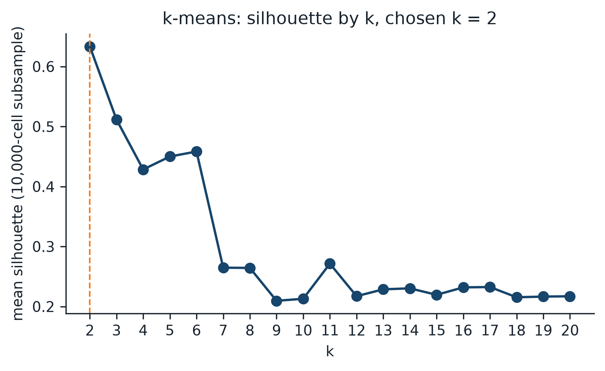

*Figure 1. Mean silhouette by k on the fixed 10,000-cell subsample. The dashed line marks the chosen k.*

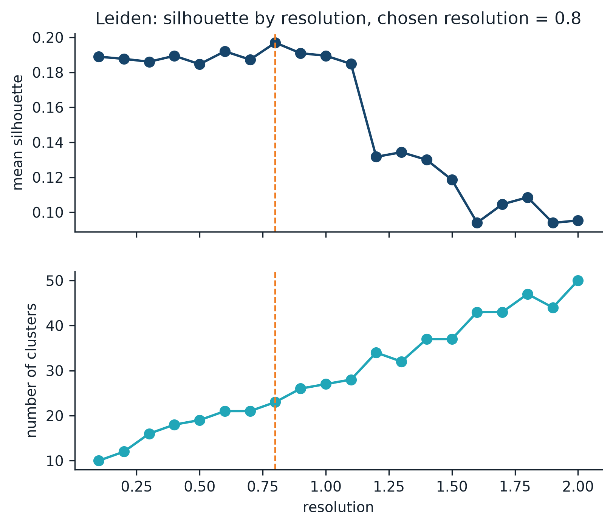

*Figure 2. Mean silhouette and number of clusters across Leiden resolutions.*

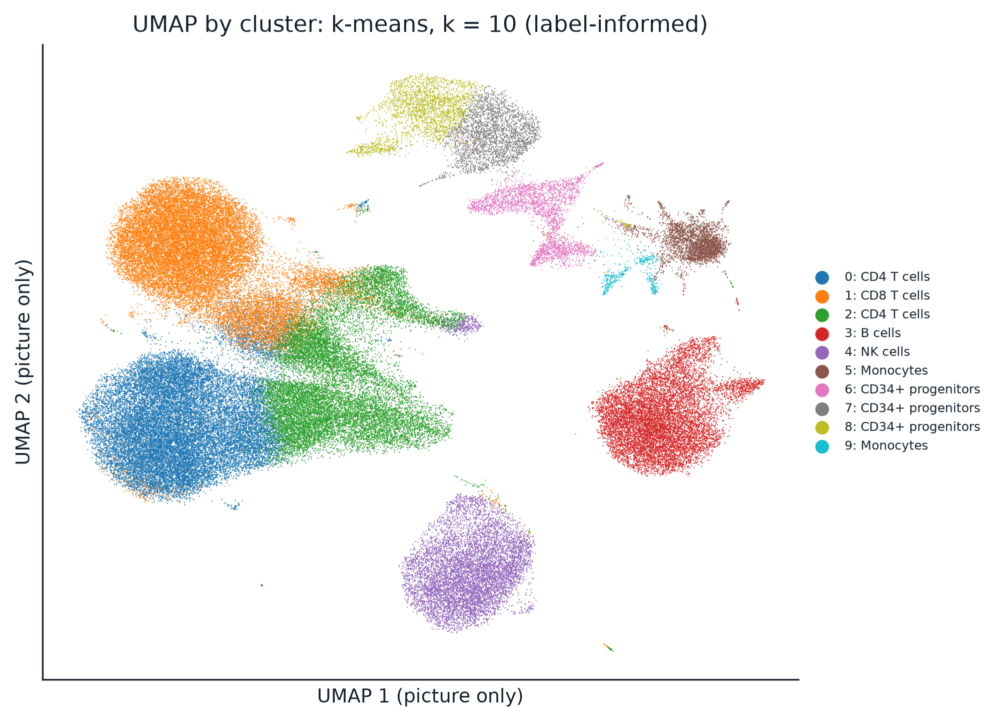

*Figure 3. The k = 10 partition on a UMAP embedding, drawn before the key was opened, with the rule-based names. UMAP is used for display only.*

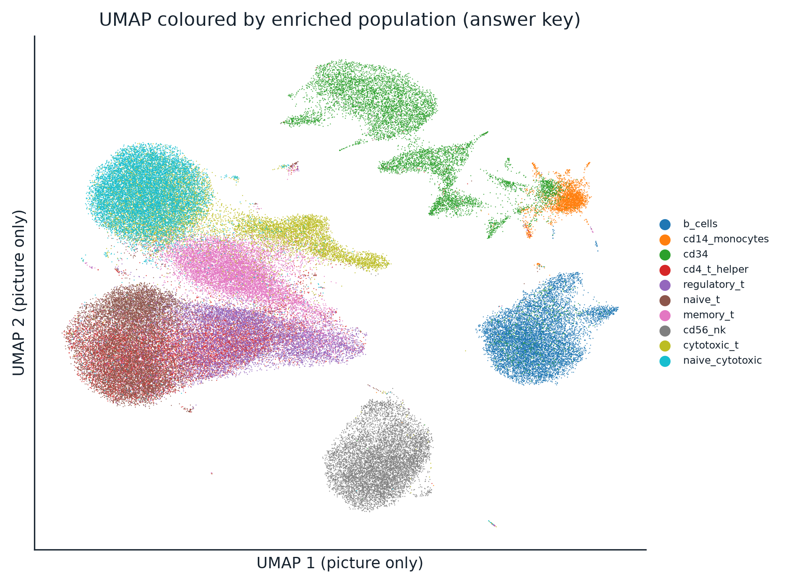

*Figure 4. The same embedding coloured by enriched population, drawn after the key was opened.*

### Agreement with the labels

| partition | ten labels: ARI (95% CI) | six lineages: ARI (95% CI) | upper edge of the null band (ten / six) |
|---|---|---|---|
| k-means, chosen k = 2 | 0.0139 (0.0134 to 0.0144) | 0.0534 (0.0518 to 0.0551) | 0.0001 / 0.0010 |
| k-means, k = 10 (label-informed) | 0.4399 (0.4366 to 0.4434) | 0.5530 (0.5490 to 0.5572) | 0.0001 / 0.0009 |
| Leiden, resolution 0.8 (23 clusters) | 0.5836 (0.5798 to 0.5878) | 0.4204 (0.4164 to 0.4245) | 0.0001 / 0.0005 |
| technical baseline, k = 2 | 0.0384 (0.0375 to 0.0393) | 0.1306 (0.1278 to 0.1333) | 0.0002 / 0.0018 |
| technical baseline, k = 10 | 0.0760 (0.0744 to 0.0775) | 0.0875 (0.0858 to 0.0892) | 0.0001 / 0.0006 |

Every partition, the technical baseline included, lies far above its shuffled-label null: the largest null value across all partitions and keys was 0.0030, and p = 0.0010 for every partition, the smallest value that 1,000 shuffles can give.

| comparison | key | ARI difference (95% CI) | verdict |
|---|---|---|---|
| k-means k = 2 minus technical k = 2 | ten labels | -0.0245 (-0.0256 to -0.0234) | does not beat |
| k-means k = 2 minus technical k = 2 | six lineages | -0.0772 (-0.0807 to -0.0736) | does not beat |
| k-means k = 10 minus technical k = 10 | ten labels | 0.3639 (0.3602 to 0.3676) | beats |
| k-means k = 10 minus technical k = 10 | six lineages | 0.4655 (0.4614 to 0.4696) | beats |
| Leiden minus k-means k = 2 | ten labels | 0.5697 (0.5661 to 0.5738) | Leiden better |
| Leiden minus k-means k = 2 | six lineages | 0.3670 (0.3622 to 0.3715) | Leiden better |
| k-means k = 10 minus k-means k = 2 | ten labels | 0.4260 (0.4227 to 0.4294) | oracle higher |
| k-means k = 10 minus k-means k = 2 | six lineages | 0.4996 (0.4950 to 0.5039) | oracle higher |

At the chosen k = 2, gene expression **does not beat** the measurement baseline on either key. The expression split separates a 3,521-cell group that is 0.7251 monocytes by label; the measurement split separates an 18,067-cell group of cells with many molecules and genes, which contains 0.8904 of the CD34+ population. Scored against the labels, the second split happens to agree better. Told to make ten groups, k-means beats the baseline clearly on both keys, and Leiden beats the chosen k-means on both keys. Leiden scores higher than ten-group k-means against the ten labels (0.5836 against 0.4399), whereas ten-group k-means scores higher against the six lineages (0.5530 against 0.4204); that comparison was not pre-registered and carries no interval.

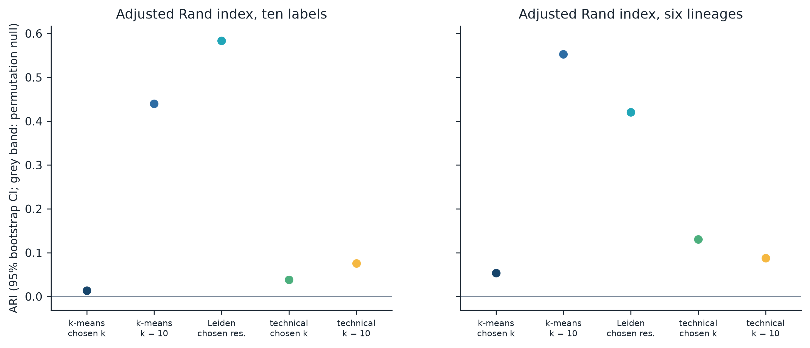

*Figure 5. Adjusted Rand index for every partition against both keys, with 95% bootstrap intervals (narrower than the markers at this sample size) and the permutation null band in grey.*

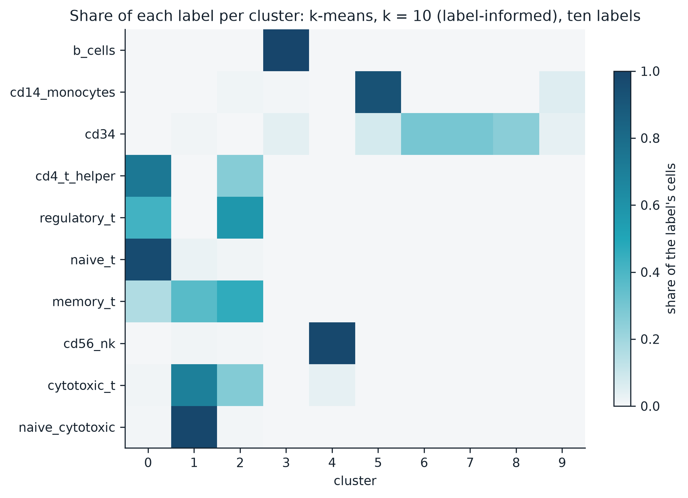

*Figure 6. Share of each label's cells in each cluster of the k = 10 partition. Rows sum to 1.*

### Predictions from Day 63

The predictions concern ten labels, so they were scored on the partition told to make ten groups.

| ID | prediction | statistic | result |
|---|---|---|---|
| P1 | B cells come back largely intact | recovery 0.9988 (threshold 0.8000) | pass |
| P2 | Monocytes come back largely intact | recovery 0.9276 (threshold 0.8000) | pass |
| P3 | NK cells partly blur into cytotoxic T cells | overlap 0.0469 (threshold 0.1000) | fail |
| P4 | The CD34+ label mostly holds together | recovery 0.2963 (threshold 0.8000) | fail |
| P5 | The six T cell labels do not separate cleanly | 0 T labels reach recovery and purity of 0.8000 | pass |
| P6 | Helper cannot separate from the labels nested within it | sub-ARI helper against naive 0.0473, naive against memory 0.4917 | pass |

4 of 6 predictions passed. P3 failed because NK cells and cytotoxic T cells barely shared clusters. P4 failed in an informative way: rather than scattering into other lineages, the CD34+ population mostly split into three clusters of its own, each at least 0.9870 CD34+ by label, so that its best single cluster holds only 0.2963 of it, at a purity of 0.9870. The same statistics for the chosen k-means and for Leiden are reported in `08_predictions.json` as description only.

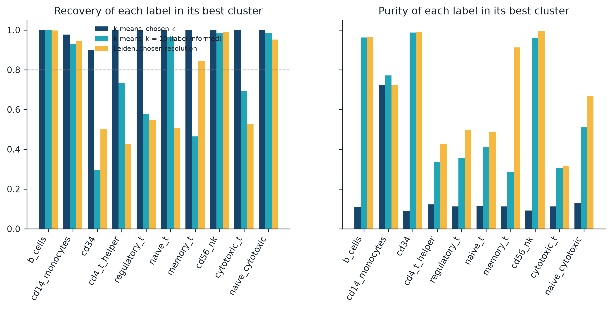

*Figure 7. Recovery and purity of each label in its best cluster, for the two k-means partitions and Leiden. The dashed line marks the 0.8000 threshold used by the predictions.*

### Naming

A name counts as correct when it matches the cluster's truth: the cluster's most common lineage if that lineage makes up at least half of it, and "unresolved" otherwise.

| names | clusters | correct | cluster accuracy | cell-weighted accuracy | named unresolved |
|---|---|---|---|---|---|
| rule, k-means k = 2 | 2 | 1 | 0.5000 | 0.0372 | 0 |
| rule, k-means k = 10 | 10 | 9 | 0.9000 | 0.9953 | 0 |
| rule, Leiden | 23 | 17 | 0.7391 | 0.9923 | 1 |
| my naming, k-means k = 2 | 2 | 2 | 1.0000 | 1.0000 | 1 |

The fixed rule called the 91,134-cell k-means cluster "CD8 T cells", because its mean CD8A and CD8B expression exceeded its CD4 expression; CD4 RNA was detected in only 0.0565 to 0.0972 of cells in the four CD4 T cell populations. The truth of that cluster is unresolved: its most common lineage, CD4 T cells, makes up 0.4627 of it, just below the 0.5000 line. The rule's other errors all concern small clusters: two clusters with myeloid markers, named monocytes, whose cells came mostly from the CD34+ tube, and a handful of small T cell clusters assigned to the wrong one of CD4 and CD8.

### Failure-mode checks

The published Day 66 post lists four of these checks (its numbering runs 1, 2, 4, 5); FM2 was declared on Day 63.

**FM1: are the runs doing the sorting?** Gene expression did not beat the measurement baseline at k = 2, and did beat it at k = 10. The nested-label test passed on the k = 10 partition: helper against naive separated far less (0.0473) than naive against memory (0.4917), so the run-driven flag is `false`, and Leiden shows the same order (0.1240 against 0.5551). The CD34+ population is the exception worth noting. Its cells yielded far more molecules and genes than any other population (a median of 4169.0000 molecules and 1274.0000 genes per cell, against 782.0000 to 1630.0000 molecules elsewhere), which could reflect the cells themselves or their run, since the dataset pages report similar sequencing depth. On the measurement numbers alone, 0.5428 of the CD34+ cells fall into one cluster at a purity of 0.9043 when k = 10. Within the best k = 10 cluster for CD34+ cells, 0.3439 of cells carry any CD34 RNA, against 0.0230 of all cells outside it; among CD34+-labelled cells the shares are 0.3441 inside and 0.3228 outside, so the labelled cells outside that cluster resemble those inside it rather than contaminants.

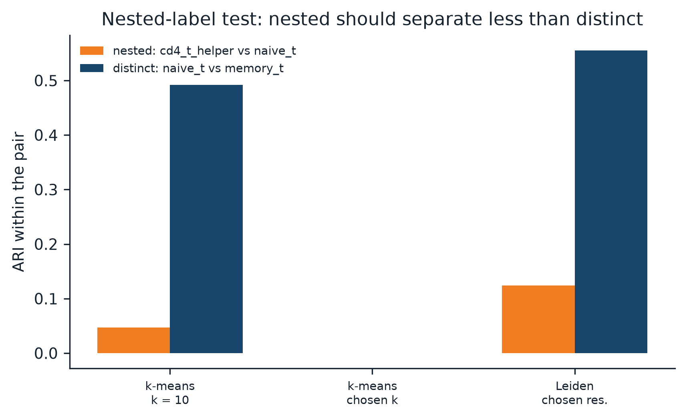

*Figure 8. Within-pair ARI for the nested pair (helper against naive) and the distinct pair (naive against memory). If the runs were driving the groups, the nested pair would separate more.*

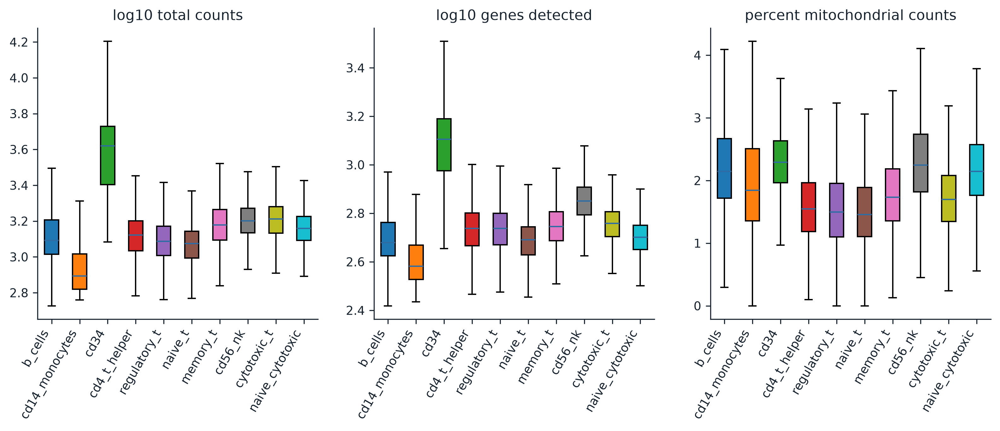

*Figure 9. Measurement numbers by population: log10 molecules, log10 genes detected and percent mitochondrial counts.*

| population | cells | median molecules | median genes | median percent mitochondrial |
|---|---|---|---|---|
| b_cells | 10,085 | 1237.0000 | 478.0000 | 2.1432 |
| cd14_monocytes | 2,612 | 782.0000 | 382.0000 | 1.8430 |
| cd34 | 9,232 | 4169.0000 | 1274.0000 | 2.2911 |
| cd4_t_helper | 11,213 | 1326.0000 | 546.0000 | 1.5494 |
| cd56_nk | 8,385 | 1590.0000 | 710.0000 | 2.2472 |
| cytotoxic_t | 10,209 | 1630.0000 | 573.0000 | 1.6979 |
| memory_t | 10,224 | 1506.0000 | 557.0000 | 1.7354 |
| naive_cytotoxic | 11,953 | 1442.0000 | 502.0000 | 2.1450 |
| naive_t | 10,479 | 1186.0000 | 490.0000 | 1.4559 |
| regulatory_t | 10,263 | 1223.0000 | 547.0000 | 1.4975 |

**FM2: is a low score the key's fault?** The score depends on the key: ten-group k-means rises from 0.4399 against ten labels to 0.5530 against six lineages. The label pairs that overlap most in the k = 10 partition are exactly the nested ones: cd4_t_helper and naive_t (0.7481), cytotoxic_t and naive_cytotoxic (0.7078), and cd4_t_helper and regulatory_t (0.6830). The genes behind the labels are largely invisible in the RNA: CD19 is detected in 0.2022 of B cells, NCAM1 (CD56) in 0.0392 of NK cells, IL2RA (CD25) in 0.0679 of regulatory T cells, CD34 in 0.3291 of the CD34+ population and CD14 in 0.5100 of monocytes. CD8B is the best detected, in 0.7337 of naive cytotoxic T cells.

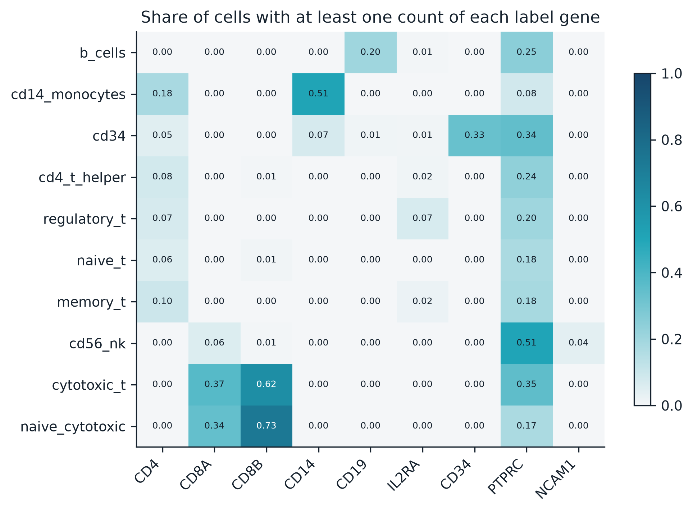

*Figure 10. Share of cells in each population with at least one count of each label gene.*

**FM3: counting against grouping.** The rule chose k = 2, not 10 (silhouette 0.6336 against 0.2129). Supplying the count raised the ten-label ARI by 0.4260 (0.4227 to 0.4294) and the six-lineage ARI by 0.4996. The count failed; the grouping, once the count was given, largely worked.

**FM4: every cell gets a home.** At k = 2, the 20 reruns reached two different solutions. 12 of the 20 found a tighter split (83,404 and 11,251 cells, inertia 15693770.7580, silhouette 0.5366), while the seed 7 primary run and 8 reruns found the looser one (91,134 and 3,521 cells, inertia 15850196.0536). The two solutions agree at an ARI of 0.4026. The tighter split agrees better with the labels (ten-label ARI 0.0575, six-lineage ARI 0.1831), above the baseline's point estimates, but that comparison was not pre-registered and has no interval; the pre-registered verdict rests on the seed 7 run. Leiden was steadier, with rerun agreement from 0.7973 to 0.9503 and ten-label ARI from 0.5708 to 0.5898. The share of cells with a negative silhouette was 0.0098 at k = 2, 0.1178 at k = 10 and 0.1399 for Leiden, and ten-group k-means and Leiden agree, without reference to any label, at 0.5407.

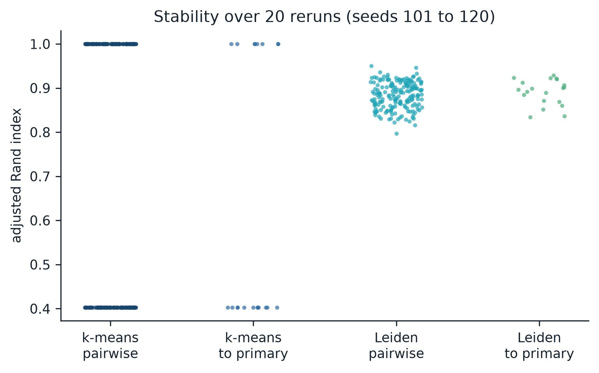

*Figure 11. Agreement between reruns, and between each rerun and the primary run, for k-means at the chosen k and for Leiden.*

**FM5: an unmatched group is not a discovery.** 9 clusters have an unresolved truth: the 91,134-cell k-means cluster, a mixture of every lineage except monocytes, and 8 clusters from the technical baseline, several of them led by mitochondrial genes, a common signature of damaged or dying cells. Neither the k = 10 partition nor Leiden contains an unresolved cluster. The rule named one Leiden cluster unresolved (34 cells, led by ribosomal genes); by the labels it is 0.8235 CD8 T cells. Sizes, lineage shares and top markers are listed in `results/tables/08_unresolved_clusters.csv`. **No new cell types are claimed.**

## Limitations

- The data come from one donor, one chemistry and one release. Label and batch coincide by design, so no result here fully separates biology from run; the nested-label test and the measurement baseline only bound that risk.
- The labels are defined by surface proteins, and several are nested or impure. ARI against them understates structure that the RNA does carry.
- The silhouette rule rewards the coarsest well-separated split. The chosen k answers "what is most separated", not "how many cell types are present".
- The primary k-means result depends on its seed: 12 of the 20 reruns found a different, tighter two-group solution.
- The bootstrap intervals describe which cells were scored with the groupings held fixed; they do not include clustering variation, which is reported separately.
- My own naming covers only the two clusters of the chosen partition, so its perfect score is a small test.

## Reproducing the analysis

```
python -m venv .venv            # Python 3.11
.venv/Scripts/pip install -r requirements.txt
python scripts/00_record_project.py
python scripts/01_download_data.py
python scripts/02_build_matrix.py
python scripts/03_preprocess.py
python scripts/04_select_k.py
python scripts/05_cluster.py
python scripts/06_blind_naming.py
python -m pytest tests
# freeze: commit the assignments with provenance/freeze_manifest.json,
# then fill and commit notes/human_naming.md before continuing
python scripts/07_evaluate.py
python scripts/08_failure_modes.py
python scripts/09_figures.py
python scripts/10_audit_readme.py
```

On the machine described in `provenance/machine.txt`, choosing k and the resolution took 1139.1917 seconds and the evaluation 1401.5957 seconds. Exact package versions are pinned in `requirements.txt`, with the full environment in `provenance/environment_freeze.txt`. The raw and intermediate data in `data/` are not tracked; scripts `01` and `02` rebuild them.

## Repository structure

| path | contents |
|---|---|
| `posts/` | the published posts, verbatim |
| `config.yaml` | every pre-registered setting |
| `scripts/common.py` | shared helpers and the guarded `open_answer_key()` |
| `scripts/00_record_project.py` to `scripts/10_audit_readme.py` | the pipeline, run in numerical order |
| `tests/` | quarantine and freeze checks |
| `results/metrics/` | the source of every number in this document |
| `results/assignments/` | frozen cluster assignments |
| `results/tables/` | marker genes, naming scores, contingency tables and label overlaps |
| `figures/` | blind figures (prefixes `03` to `06`) and figures drawn after the key was opened (prefix `09`) |
| `notes/` | pre-registration, blind report, naming table, deviations and decisions |
| `provenance/` | download log, file hashes, environment and freeze manifest |

## Citation

Data: Zheng GXY et al. Massively parallel digital transcriptional profiling of single cells. Nature Communications 8:14049 (`2017`), doi `10.1038/ncomms14049`. Data released by 10x Genomics under `CC BY 4.0`.

Re-analysis cited for prediction P4: Stephens lab, single-cell-topics, https://github.com/stephenslab/single-cell-topics
